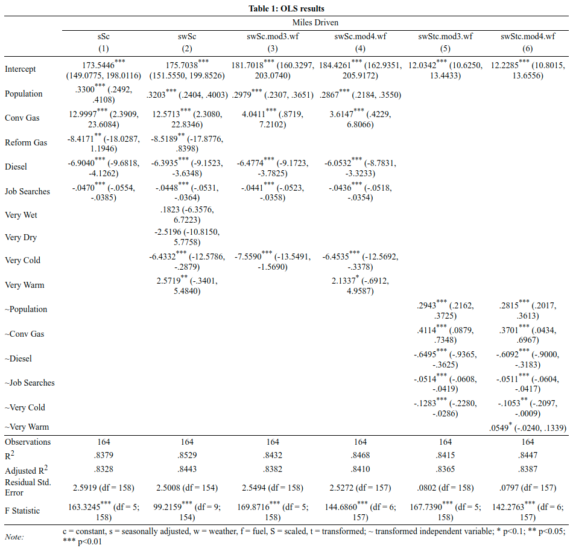
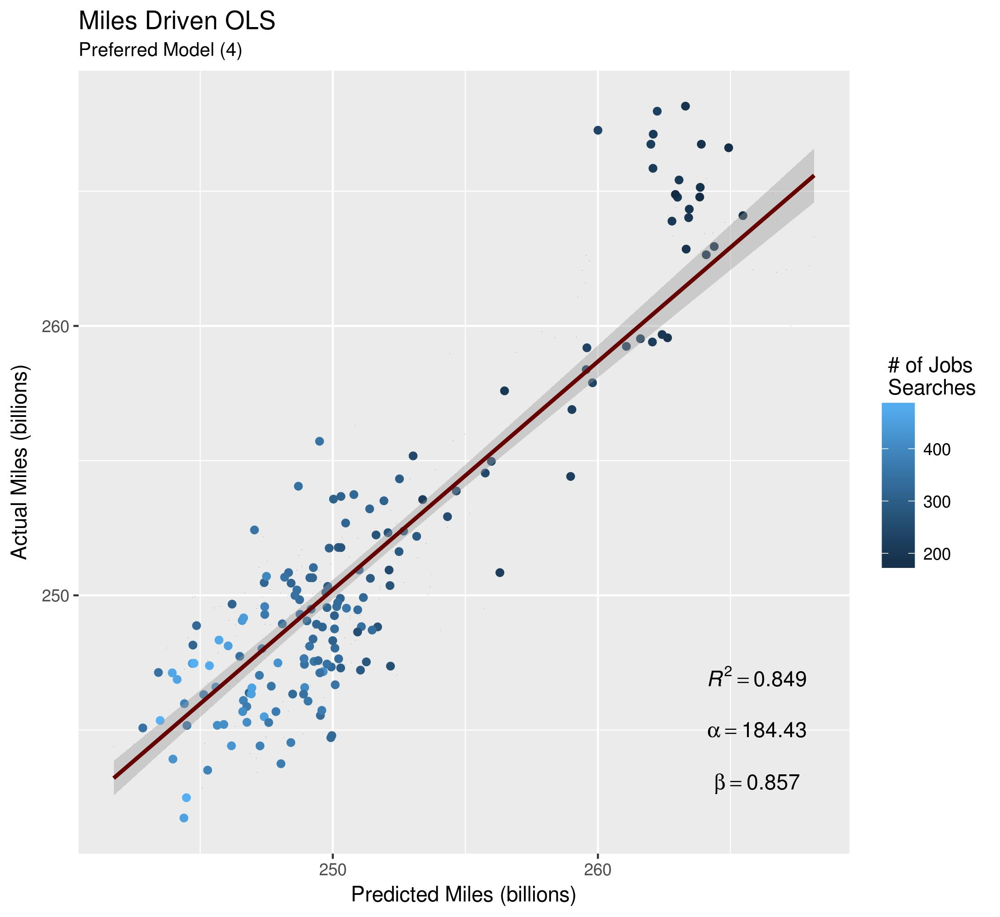

# Using Online Job Searches to Estimate Traffic

## Project Objective
The purpose of this project is to estimate the number of miles driven using online job searches. The following question is addressed: Does the number of job searches affect the number of miles driven?

## Methods
* Exploratory Data Analysis
* Data Visualization
* Feature Selection
* Linear Regression

## Technologies
* R
* R Packages:
    * ggplot2
    * stargazer

## Getting Started
1. Clone this repo.
2. Data for this project can be found in /assets.
3. Plots generated by this analysis can be found in /plots.

## Project Description
Sitting in traffic during a daily commute is an experience to which most can relate, and it has even become synonymous with the American way of life. It involves accidents, the loss of time spent idle, road rage, and pollution. As if to add insult to injury, all of this can be had for the price of a depreciating car, fuel, and insurance. For many, it is an inescapable reality that something more productive could be done during this time. Determinants of the number of miles that are driven each year include population, the quality and access to public transportation, the condition of the job market, fuel price levels, and more. New, digital technologies offer new vantage points from which researchers can observe and record human behavior. And, as social interactions take place online at an increasing rate, researchers are now able to observe human behavior in ways which might allow them to include new data in a model, as well as to measure and evaluate existing determinants used by previous models in
new ways. The purpose of this study is to understand the significance these data might have when used to model the number of miles driven. The following question will be addressed: Does the number of online job searches affect the number miles driven? It is expected that the number of job searches reflects the level of employment and a decrease of employment should reduce commuter traffic, as well as, traffic associated with recreation and consumption. As part of this study, investigation will include the following hypothesis:

$ {H}_0:$ A greater number of online job searches does not result in fewer miles driven.

$ β = 0, p > 0.05 $

## I. Data
The data used in this study include 164 observations of monthly time series data for the entire United States and they range from January 2004 to August 2017. Included are the monthly number of miles driven as the dependent variable. For these data, seasonally adjusted and not seasonally adjusted data were evaluated. These data, as well as the population data come from Federal Reserve Economic Data (FRED) which is maintained by the Federal Reserve Bank of St. Louis. Retail fuel prices come from the U.S. Energy Information Agency (EIA) and are expressed in US Dollars per gallon including taxes. The prices of conventional gasoline,
reformed gasoline, and number 2 diesel were evaluated as separate variables. Weather data come from the National Centers for Environmental Information of the National Oceanic and Atmospheric Administration. These data measure the number of weather anomalies that have occurred for a given month. An anomaly is defined as any day with weather that is in the top or bottom 10 percent of the historical distribution. With respect to the data used for this study, the top 10 percent includes “very warm” and/or “very wet” days while the bottom 10 percent includes days that are classified as “very cold” and/or “very dry”. Jobs data are from Google Trends and are the aggregates of what Google refers to as “interest over time”. Numbers reflect a level of interest relative to the greatest and lowest levels of interest over a given timeframe. Interest is expressed when individuals enter search terms at the search bar. For this study, queries used in the aggregate figure include, but are not limited to the following: “jobs”, “unemployment”, and “job listings”.

## II. Methodology
The results presented for each month are from an ordinary least squares regression of the following form:

$ {miles}_{i} = { \alpha }_i + {{ \beta }_i}_1pop_i + {{ \beta }_i}_2X_i + {{ \beta }_i}_3Z_i + {{ \beta }_i }_4jobs_i + { \epsilon }_i $

where i indexes the month and the dependent variable is the number of total miles driven in the United States. Of the independent variables, α is the intercept, pop is the population of the U.S.; X is some combination of the retail prices expressed as U.S. Dollar per gallon of reformed gasoline, conventional gasoline, and number 2 diesel; Z is some combination of the variables representing the number of days of very wet, very warm, very dry, or very cold weather; jobs is the sum of the level of interest of a list of search terms which represent an individual’s need or desire to find a job; and, ε is the error term. The number of miles driven was modeled using both seasonally adjusted and not seasonally adjusted data. Different combinations of independent variables were used. The data were scaled and in some models, the data were transformed by taking their square roots.

## III. Results
Table 1 shows the results of selected models. Estimations of seasonally adjusted miles driven were the most successful as including these data helps to control for weather. As expected, job search coefficients have negative slopes, as expected and are significant at the 99.0 percent level for each of the models shown. Of the weather variables, only the very warm and very cold weather variables were statistically significant. The price of reformulated gas was not as significant as that of conventional gas and diesel, so it was not included in models (3) through (6). Population coefficients across all models have similar magnitudes and positive correlations with miles driven at the 99.0 percent significance level. 

Model (1) performed well, however additional variation in the independent variable can be explained by including weather variables. All weather variables from this data were included in Model (2). Despite having the highest R 2 , the variables measuring very dry and very wet weather are not statistically significant. Model (3) included only a variable for very cold days which resulted in an R 2 of 0.8529. All independent variables in this model are statistically significant at the 99.0 percent level. With a Residual Standard Error of 2.5 billion miles, the model’s predictions are within 1.0 percent of the mean of the seasonally adjusted miles driven of 251.4 billion. The negative signs of the coefficients of -7.6 and -0.04 on very cold days and job searches, respectively are in line with expectations. One additional day of weather that is colder than 90 percent of historic distribution of weather results in 7.5 billion fewer miles. And, one more percentage point of interest over the mean of the expressed interest in jobs as measured from 2004 to 2017 results in more than 0.4 billion fewer miles driven per month. The difference in the magnitudes of the slopes of these two variables is expected. A downturn in an economy might affect everyone who experiences it, but most people are not so negatively affected as someone who has lost a job. Weather, on the other hand, affects everyone who experiences it in a more uniform manner. Cold or snowy weather can cause people to stay home from work and school, and it can, also reduce recreation that would have occurred if the weather was not so cold. Each of these scenarios results in fewer people driving, and, ultimately in fewer miles being driven. Therefore, the results of the model that suggest that there is a greater decrease in the number of miles driven due to very cold weather than that of the number of miles driven due to lost jobs is in line with theory. Model (5) has the same specifications as Model (3), with the exception that the dataset is transformed by taking its square root. The R 2 decreases slightly to
0.8415, however the Residual Standard Error indicates that, on average, the accuracy of the model is increased. The estimations of the model are within 0.5 percent of the mean of the actual miles driven.

Models (4) and (6) estimate the number of miles driven by including a variable for very warm weather. Transforming the data results in a lower R 2 of 0.8387 for Model (6). For both models, the significance of the coefficients on the variables for very warm days at the 90.0 percent level is lower than that of the other variables. However, R 2 values of 0.8468 and 0.8447 for Model (4) and Model (6), respectively show that the two models explain much of the variation of the independent variable. On average, each produces estimates of the number of miles driven within 1.0 percent of the mean of the actual miles driven. However, within 0.49 percent, (6) is slightly more accurate.

## IV. Conclusion
The preferred model is (4). The model for the preferred model is below:

The variables are significant at the 99.0 percent level with the exception of the variable for very warm days which is significant at the 90.0 percent level. Its inclusion resulted in the adjusted R 2 increasing to 0.8410 from Model (3) (0.8382). The warm days variable explains some variation in the number of miles driven due to weather and its inclusion is in line with theory. The number of miles driven is expected to increase slightly as employees must go to work on these days and driving due to recreation such as travelling to an ocean or to a lake is likely to increase. This is reflected in both sign and magnitude of the coefficient (2.133). The sign and the greater magnitude for very cold days (-6.453) is likely due to an inability to drive due to snow and/or a lack of desire to leave the house. The coefficient for job searches is -0.0436. The model estimates that, on average, the number of miles driven each month decreases by 0.44 billion, all other things remaining equal. And, because the jobs variable is significant at the 99.0 percent level, the null hypothesis that β=0 is rejected. The number of online jobs searches, therefore is significant enough to include in this model for the number of miles driven. Chart 1 shows the actual versus fitted values for the model.

Looking forward, there is a need to address the heteroskedasticity of the population data.

Below is a table of the results from the most promising models.

The plot of the number of miles driven predicted by the preferred specification versus the actual miles driven is below. It includes the line of best fit, and each data point is shaded based on the number of job searches.

